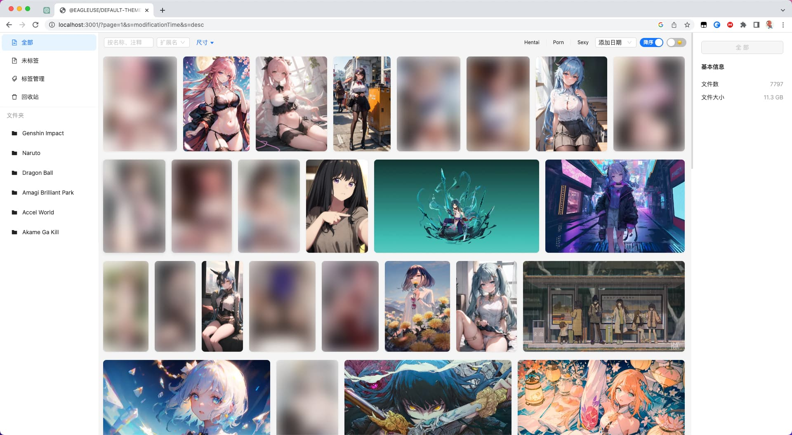
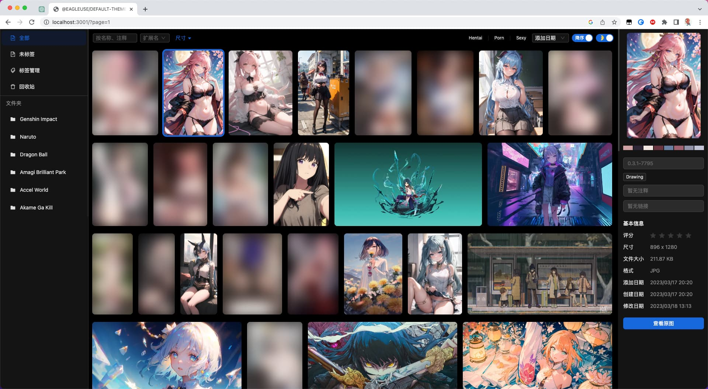
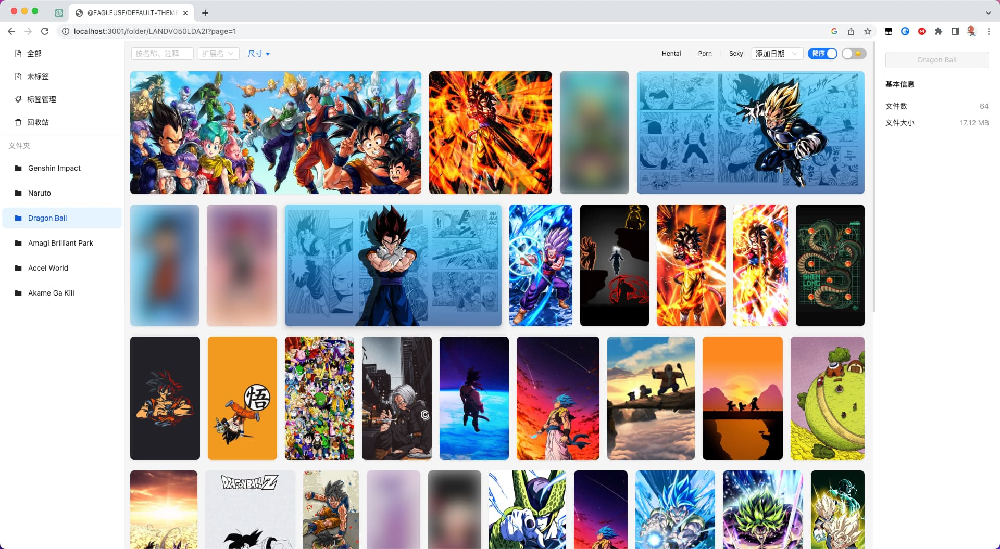
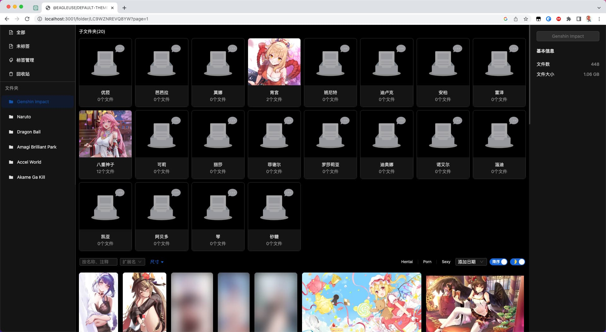
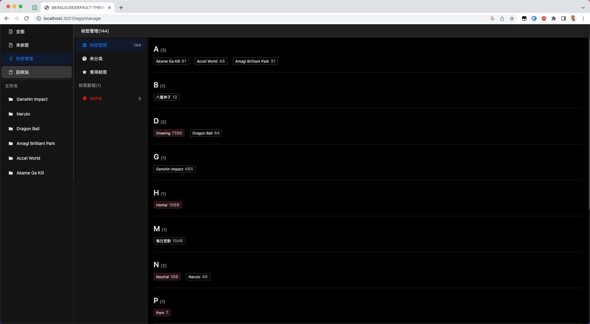

<p align='center'>
    <a href="https://github.com/meetqy/eagleuse/blob/master/LICENSE" target="_blank">
        
    </a>
    <a href="https://www.typescriptlang.org" target="_black">
        
    </a>
    <a href="https://github.com/prettier/prettier" target="_black"> 
         
    </a>
</p>

<p align='center'>
   <a href='https://docs.rao.pics'>在线文档</a> · <a href='https://rao.pics'>线上演示</a> · <a href='https://github.com/rao-pics/core'>Core</a>
</p>

## Rua

[rao.pics](https://github.com/rao-pics/core) 默认主题，支持 Ipad、暗黑模式、使用 nextjs 开发。

## 📷 截图

| Light                      | Dark                       |
| -------------------------- | -------------------------- |
|  |  |
|  |  |
|  |  |

## 👀 使用

在`.env`中配置

```sh
# 请求接口配置
API_HOST=
```

运行

```
pnpm i
pnpm dev
```
## ☞ License

Copyright (c) 2022 @rao-pics - [MIT](https://github.com/meetqy/eagleuse/blob/master/LICENSE)
